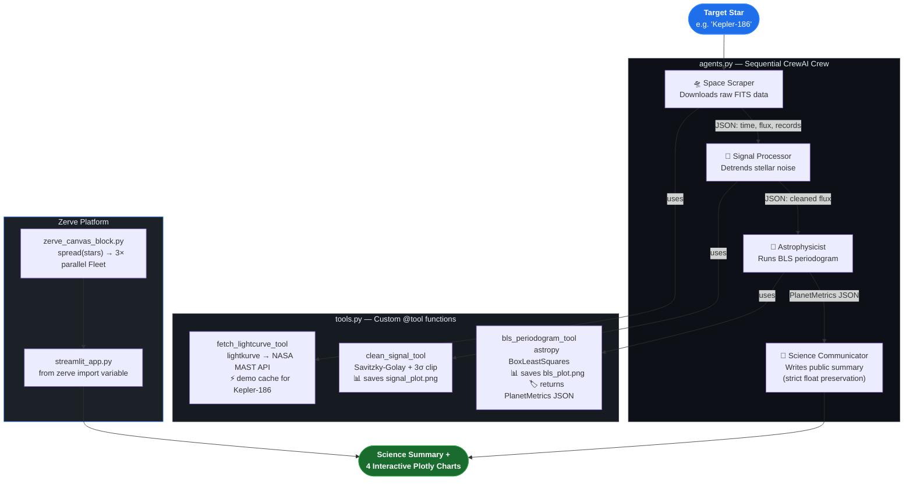

# 🚀 Exoplanet Swarm

> A production-ready multi-agent CrewAI pipeline that autonomously ingests raw NASA telescope data, processes the photometric signal, runs Box-fitting Least Squares (BLS) transit detection mathematics, and produces a peer-quality science summary — deployed as an interactive Streamlit app on Zerve.ai.

---

## 🌌 Live Demo

**Deployed on Zerve.ai** — select a star, click Run Swarm, watch 4 AI agents hunt for planets in real NASA data.

| Pipeline Step | Agent | Time (Kepler-186) |
|---|---|---|
| 🛸 NASA MAST data retrieval | Space Scraper | ~1s (demo cache) |
| 📡 Photometric detrending | Signal Processor | ~4s |
| 🔭 BLS transit search | Astrophysicist | ~70s |
| 📝 Public science summary | Science Communicator | ~10s |

---

## Architecture

### Three-File Code Split

| File | Responsibility |
|---|---|
| `tools.py` | All NASA fetch, signal processing, and BLS math — zero LLM imports |
| `agents.py` | CrewAI Agent/Task definitions, lazy LLM singleton, `make_crew()` |
| `main.py` | CLI entry point — `python main.py "Kepler-186"` |

### Zerve Platform Architecture

| Layer | File | Purpose |
|---|---|---|
| **Canvas / Fleets** | `zerve_canvas_block.py` | Paste into Zerve Python block; `spread()` fans to 3 parallel runs |
| **Bridge** | `streamlit_app.py` | `from zerve import variable` reads pre-computed Fleet results |
| **Hosted App** | `streamlit_app.py` | Deployed via Zerve → Hosted Apps → Python |

### Agent Flow Diagram



---

## Quickstart

### 1. Install dependencies

```bash
pip install -r requirements.txt
```

### 2. Configure environment

Copy `.env.example` to `.env` and fill in your keys:

```bash
cp .env.example .env
```

```env
OPENAI_API_KEY=sk-...
LANGCHAIN_API_KEY=lsv2_...   # optional — enables LangSmith tracing
```

> **Swap LLMs**: Replace `ChatOpenAI` in `agents.py` with any LangChain-compatible provider.

### 3. Run the Streamlit app (local)

```bash
streamlit run streamlit_app.py
```

The app auto-detects that it's running locally (`from zerve import variable` fails gracefully) and runs the pipeline step-by-step with live progress.

### 4. Run the CLI pipeline

```bash
python main.py "Kepler-186"
python main.py "TOI 700"
```

### 5. Generate interactive visualization (HTML)

```bash
python visualize.py "Kepler-186"          # runs pipeline + exports HTML
python visualize.py --cached              # uses tests/fixtures/ cache (fast)
```

Outputs `kepler186_transit_analysis.html` — fully interactive Plotly 4-panel chart.

---

## Zerve Deployment

### Step 1 — Canvas Block (Heavy Compute via Fleets)

1. Create a new Python block on the Zerve canvas, name it **`swarm_execution`**
2. Paste the contents of `zerve_canvas_block.py`
3. Use Zerve's `spread(["Kepler-186", "Kepler-442", "TOI 700"])` to fan into **3 parallel Fleet executions**
4. Connect to a **Gather block** — output becomes `final_results_dict`

### Step 2 — Hosted App (Frontend)

In Zerve → Organization → **Hosted Apps**:

| Setting | Value |
|---|---|
| App Type | Python |
| App Script Name | `streamlit_app.py` |
| Requirements | `requirements.txt` |

Add secrets in **Assets → Constants & Secrets**:
- `OPENAI_API_KEY` → mark as **Secret**
- `LANGCHAIN_API_KEY` → mark as **Secret** (optional)

### Step 3 — How it works on Zerve

```python
# streamlit_app.py — Zerve runtime path
from zerve import variable

# Reads results pre-computed by the Fleet (no re-running agents)
final_results_dict = variable("swarm_execution", "final_results_dict")
star_result = final_results_dict["Kepler-186"]
```

When `zerve` is not installed (local), the app runs the pipeline itself — same UI, same results.

---

## Running Tests

```bash
# Unit tests — fully mocked, no network, ~5s
pytest tests/ -v -m unit

# Integration tests — real Kepler-186 NASA MAST data
# (caches to tests/fixtures/ after first download)
pytest tests/ -v -m integration

# Everything (27 tests)
pytest tests/ -v
```

### What the integration suite validates

Fetches **146,046 actual Kepler photometric cadences** from NASA MAST and asserts:

| Test | What it checks |
|---|---|
| `test_raw_fetch_has_enough_cadences` | `records > 10,000` |
| `test_raw_time_is_monotonically_increasing` | Timestamps sorted (seam fix) |
| `test_clean_flux_std_is_smaller_than_raw` | Cleaning actually helps |
| `test_bls_period_matches_a_known_kepler186_orbit` | Period within 15% of confirmed orbit or alias |
| `test_bls_has_planet_detected_field` | `PlanetMetrics.planet_detected` is bool |
| `test_planet_probability_is_meaningful` | `P > 0.30` on real data |

---

## Key Design Details

### Demo Cache (Zero-Latency Kepler-186)

`fetch_lightcurve_tool` checks for `demo_kepler186_data.csv` before hitting MAST:

```python
if star_id == "Kepler-186" and os.path.exists("demo_kepler186_data.csv"):
    # Instant load — 73,023 cadences from CSV, no network call
```

All other stars: downloads **1 quarter only** (`search_result[:1]`) to prevent memory overflow on Zerve containers.

### PlanetMetrics — Strict Pydantic Schema

`bls_periodogram_tool` always returns data conforming to:

```python
class PlanetMetrics(BaseModel):
    star_id:               str
    mission:               str
    orbital_period_days:   float   # never rounded downstream
    transit_depth_ppm:     float
    transit_duration_days: float
    planet_probability:    float
    snr:                   float
    detection_quality:     str     # 'Strong' | 'Moderate' | 'Weak' | 'Noise'
    planet_detected:       bool    # True if SNR ≥ 7
```

The Science Communicator is strictly prompted to quote floats **verbatim** — no rounding.

### Visual Paper Trail (Auto-Generated Plots)

Each tool call saves a diagnostic plot to the working directory:

| File | Generated by | Contents |
|---|---|---|
| `signal_plot.png` | `clean_signal_tool` | Raw flux + SG trend + cleaned flux |
| `bls_plot.png` | `bls_periodogram_tool` | BLS spectrum + phase-folded curve |

These render automatically on the Zerve canvas after each agent run.

### LangSmith Tracing

Set `LANGCHAIN_API_KEY` and every agent step, tool call, and LLM invocation appears at **smith.langchain.com** under project `exoplanet-swarm`.

---

## Project Structure

```
zerve-ai/
├── tools.py                  # @tool functions — fetch, clean, BLS + PlanetMetrics
├── agents.py                 # CrewAI agents, tasks, make_crew()
├── main.py                   # CLI: python main.py "Kepler-186"
├── streamlit_app.py          # Zerve Hosted App — dual-mode (Fleet or local)
├── zerve_canvas_block.py     # Paste into Zerve canvas block 'swarm_execution'
├── visualize.py              # Plotly 4-panel interactive visualization
├── demo_kepler186_data.csv   # 73k-cadence demo cache (no MAST download needed)
├── requirements.txt
├── pytest.ini                # custom markers: unit, integration
├── .env.example
├── .gitignore
├── README.md
└── tests/
    ├── conftest.py                 # session-scoped MAST fixture cache
    └── test_exoplanet_swarm.py     # 16 unit + 11 integration tests (27 total)
```

---

## Target Stars

| Star | Why it's interesting |
|---|---|
| `Kepler-186` | 5 planets; Earth-size in habitable zone (186f) · **demo default** |
| `Kepler-442` | Super-Earth in habitable zone, high habitability score |
| `TOI 700` | TESS habitable zone Earth-size planet |
| `Kepler-62` | Two habitable zone planets (62e, 62f) |
| `Kepler-452` | Earth's "cousin" — 385-day year |

---

## Dependencies

| Package | Purpose |
|---|---|
| `crewai` | Multi-agent orchestration |
| `langchain-openai` | LLM interface |
| `lightkurve` | NASA MAST data retrieval |
| `astropy` | BLS periodogram, units |
| `scipy` | Savitzky-Golay filter |
| `numpy` | Numerical operations |
| `pandas` | DataFrame handling |
| `plotly` | Interactive visualization |
| `streamlit` | Web app frontend |
| `pydantic` | Strict output schema (PlanetMetrics) |
| `python-dotenv` | `.env` loading |
