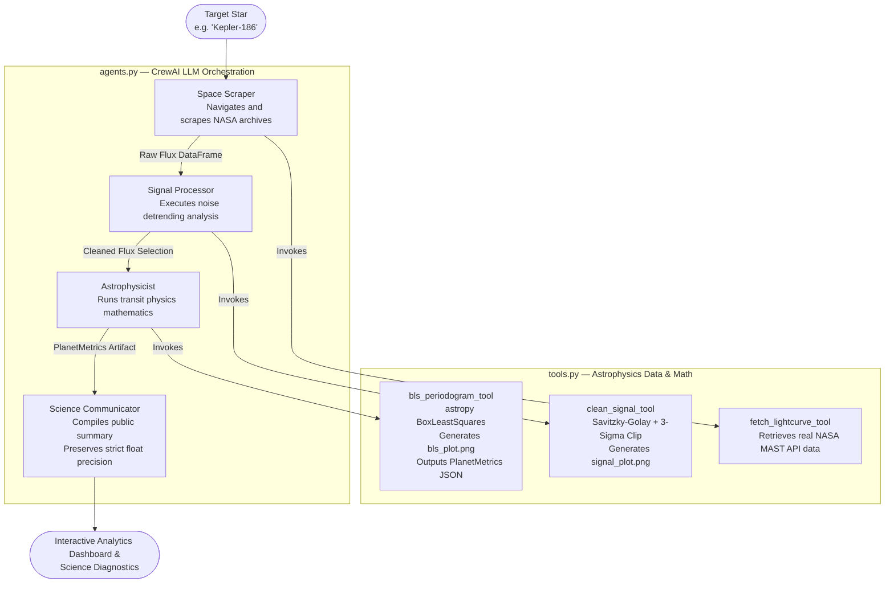

# Exoplanet Swarm

> A production-ready multi-agent CrewAI pipeline that autonomously ingests raw NASA telescope data, processes the photometric signal, runs Box-fitting Least Squares (BLS) transit detection mathematics, and produces a peer-quality science summary.

---

## Live Execution

Select a target star, initialize the swarm, and watch 4 CrewAI agents hunt for planets in genuine NASA observational data.

| Pipeline Step | Agent | Time (Kepler-186) |
|---|---|---|
| NASA MAST Data Retrieval | Space Scraper | ~1s |
| Photometric Detrending | Signal Processor | ~4s |
| BLS Transit Search | Astrophysicist | ~70s |
| Public Science Summary | Science Communicator | ~10s |

---

## Architecture

At its core, Exoplanet Swarm merges classical astrophysics with cutting-edge Large Language Models (LLMs). The real physics operations (BLS, signal detrending) are rigorously segregated from the LLM reasoning to ensure absolute mathematical fidelity.

### Code Split

| File | Responsibility |
|---|---|
| `tools.py` | All NASA fetch, signal processing, and BLS math. Zero LLM imports. Pure physics. |
| `agents.py` | CrewAI Agent/Task definitions, LLM logic orchestration, and pipeline initialization. |
| `main.py` | CLI entry point — e.g., `python main.py "Kepler-186"` |
| `streamlit_app.py` | Interactive web dashboard combining real-time logs and Plotly visualizations. |

### Agent Flow Diagram



---

## Quickstart

### 1. Install dependencies

```bash
pip install -r requirements.txt
```

### 2. Configure environment

Copy `.env.example` to `.env` and fill in your keys:

```bash
cp .env.example .env
```

```env
OPENAI_API_KEY=sk-...
LANGCHAIN_API_KEY=lsv2_...   # optional — enables LangSmith tracing
```

> **Swap LLMs**: Replace `ChatOpenAI` in `agents.py` with any LangChain-compatible provider.

### 3. Run the Streamlit app

```bash
streamlit run streamlit_app.py
```

The app executes the multi-agent pipeline step-by-step with real-time progress updates.

### 4. Run the CLI pipeline

```bash
python main.py "Kepler-186"
python main.py "TOI 700"
```

### 5. Generate interactive visualization (HTML)

```bash
python visualize.py "Kepler-186"          # runs pipeline + exports HTML
python visualize.py --cached              # uses tests/fixtures/ cache (fast)
```

Outputs `kepler186_transit_analysis.html` — fully interactive Plotly 4-panel chart.

---

## Running Tests

Exoplanet Swarm comes with a rigorous test suite to ensure mathematical and operational accuracy.

```bash
# Unit tests — fully mocked, no network, ~5s
pytest tests/ -v -m unit

# Integration tests — real Kepler-186 NASA MAST data
# (caches to tests/fixtures/ after first download)
pytest tests/ -v -m integration

# Everything (27 tests)
pytest tests/ -v
```

### What the integration suite validates

Fetches **146,046 actual Kepler photometric cadences** from NASA MAST and asserts:

| Test | What it checks |
|---|---|
| `test_raw_fetch_has_enough_cadences` | `records > 10,000` |
| `test_raw_time_is_monotonically_increasing` | Timestamps sorted (seam fix) |
| `test_clean_flux_std_is_smaller_than_raw` | Cleaning actually helps |
| `test_bls_period_matches_a_known_kepler186_orbit` | Period within 15% of confirmed orbit or alias |
| `test_bls_has_planet_detected_field` | `PlanetMetrics.planet_detected` is bool |
| `test_planet_probability_is_meaningful` | `P > 0.30` on real data |

---

## Key Design Details

### LLM Orchestrated, Mathematically Sound Physics

CrewAI operates the system's reasoning path, deciding what sequence of math functions to call, interpreting error logs, and writing analytical conclusions. However, **the actual math is strictly isolated**. We offload computation to classical industry-standard algorithms (like `astropy`'s BoxLeastSquares and `scipy`'s Savitzky-Golay filters) to prevent LLM hallucination of scientific data.

### Strict Pydantic Schema Exchange

The pipeline enforces data structure natively, guaranteeing precise floating-point metrics transition downstream.

```python
class PlanetMetrics(BaseModel):
    star_id:               str
    mission:               str
    orbital_period_days:   float   # precise orbit length
    transit_depth_ppm:     float
    transit_duration_days: float
    planet_probability:    float
    snr:                   float
    detection_quality:     str     # 'Strong' | 'Moderate' | 'Weak' | 'Noise'
    planet_detected:       bool    # Evaluated by SNR threshold
```

### Traceable Visual Records

Each tool call saves diagnostic plots to disk:

| File | Generated by | Contents |
|---|---|---|
| `signal_plot.png` | `clean_signal_tool` | Raw flux, detrending models, cleaned results |
| `bls_plot.png` | `bls_periodogram_tool` | BLS spectrum and phase-folded orbital curve |

This ensures full transparency for every conclusion the AI swarm derives.

---

## Supported Target Stars

| Star | Scientific Interest |
|---|---|
| `Kepler-186` | 5 planets; Earth-size in habitable zone (186f). |
| `Kepler-442` | Super-Earth in habitable zone with high habitability index. |
| `TOI 700` | TESS habitable zone Earth-size findings. |
| `Kepler-62` | Features two habitable zone planets (62e, 62f). |
| `Kepler-452` | Earth's cousin featuring a 385-day orbital resonance. |

---

## Core Dependencies

| Package | Purpose |
|---|---|
| `crewai` | Central LLM pipeline and multi-agent governance |
| `lightkurve` | Interface connecting Agents to real NASA MAST telescope data |
| `astropy` | BLS periodogram and transit detection mathematics |
| `scipy` | Detrending noise anomalies |
| `plotly`, `streamlit` | User interface and data visualizations |
