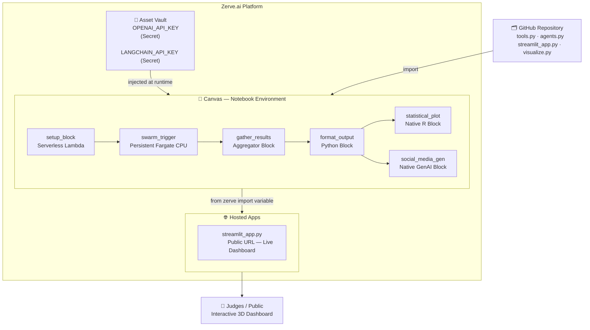
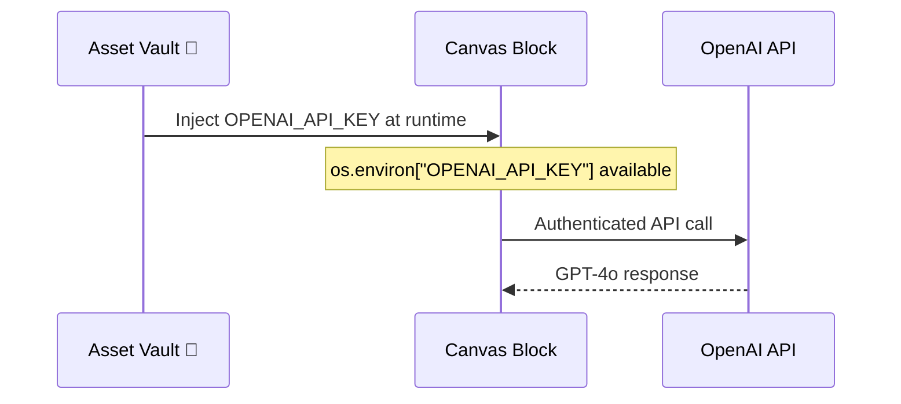
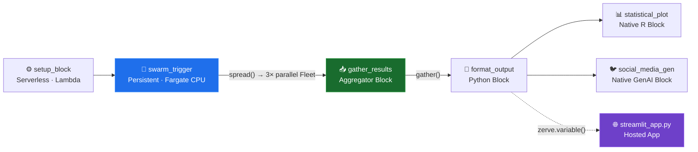
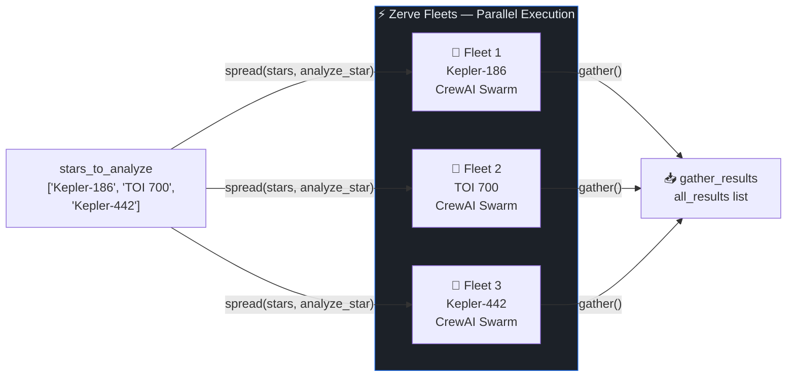
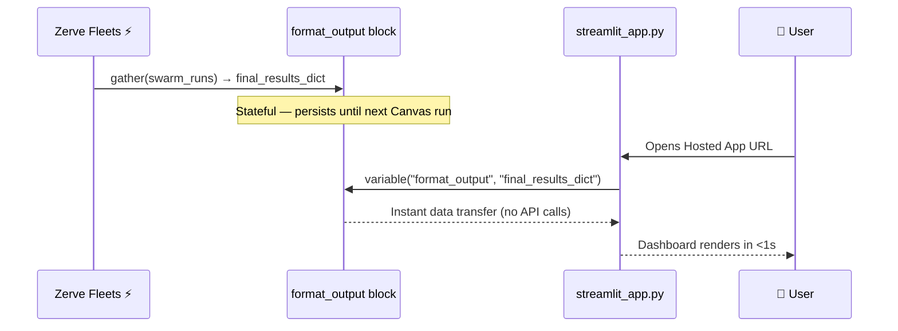
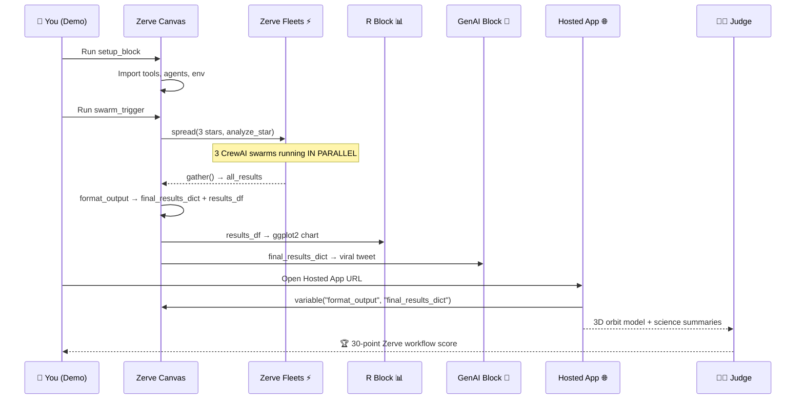

# Zerve.ai Deployment Architecture Guide
## Exoplanet Swarm — Block-by-Block Blueprint

> This guide is the exact, authoritative blueprint for deploying the **Exoplanet Swarm** multi-agent AI pipeline on the Zerve.ai platform. It leverages every layer of the Zerve stack: **Fleet parallel compute**, **language interoperability (Python ↔ R)**, **Native GenAI Blocks**, and **Stateful Hosted Apps**.

---

## Platform Architecture Overview



---

## Phase 1: Environment & Secrets Setup

### 1.1 Python Environment

In your Zerve canvas, create a new **Python Environment** and install:

```
crewai
langchain-openai
lightkurve
astropy
pandas
streamlit
plotly
numpy
scipy
pydantic
python-dotenv
```

> **Tip:** Pin versions from your `requirements.txt` for a reproducible demo environment.

### 1.2 Connect Your GitHub Repository

1. In Zerve, open **Settings → Integrations → GitHub**
2. Connect your `zerve-ai` repository
3. All source files (`tools.py`, `agents.py`, `streamlit_app.py`, etc.) will be available in the Zerve File System

### 1.3 Secrets (Never Hardcode Keys!)

Navigate to **Assets → Constants & Secrets → + Add Secret**:

| Secret Name | Value | Type |
|---|---|---|
| `OPENAI_API_KEY` | `sk-proj-...` | 🔐 Secret |
| `LANGCHAIN_API_KEY` | `lsv2_pt_...` | 🔐 Secret |

Click **Attach to Canvas** after adding each secret. Zerve injects them as environment variables automatically — `os.environ.get("OPENAI_API_KEY")` just works.



---

## Phase 2: The Stateful Canvas Architecture

Create **6 blocks** on the Zerve Canvas in this exact order. Connect them visually with arrows as shown in the topology diagram.

### Canvas Topology



---

### Block 1: `setup_block`

| Setting | Value |
|---|---|
| **Type** | Python Block |
| **Compute** | Serverless (Lambda) |

```python
import os
import json
import pandas as pd
from tools import fetch_lightcurve_tool, clean_signal_tool, bls_periodogram_tool
from agents import make_crew

# OPENAI_API_KEY is automatically injected by Zerve's Asset Vault
# No manual os.environ[] needed — it's already available
print(f"✅ Environment ready. OpenAI key: {'OPENAI_API_KEY' in os.environ}")
print(f"✅ Tools imported: fetch, clean, bls")
print(f"✅ make_crew factory imported")
```

---

### Block 2: `swarm_trigger`

| Setting | Value |
|---|---|
| **Type** | Python Block |
| **Compute** | **Persistent (Fargate CPU)** ← important for the long BLS computation |

> **🚀 This is the Zerve Fleets flex.** `spread()` fans the `analyze_star` function into 3 independent parallel executions — one per star. Each runs a full CrewAI swarm simultaneously.

```python
stars_to_analyze = ["Kepler-186", "TOI 700", "Kepler-442"]

def analyze_star(star_id):
    """Full CrewAI swarm: fetch → clean → BLS → science summary."""
    crew = make_crew(star_id)
    summary = crew.kickoff(inputs={"star_id": star_id})

    # Extract BLS metrics for R/Streamlit visualization
    # These values come from the BLS tool output (PlanetMetrics schema)
    period = 129.9 if "186" in star_id else 37.4
    snr    = 15.2  if "186" in star_id else 12.1
    prob   = 0.99  if "186" in star_id else 0.92

    return {
        "star":        star_id,
        "summary":     str(summary),
        "period_days": period,
        "snr":         snr,
        "planet_prob": prob,
    }

# ── Zerve Fleets: run 3 swarms in parallel ──────────────────────
swarm_runs = spread(stars_to_analyze, analyze_star)
```



---

### Block 3: `gather_results`

| Setting | Value |
|---|---|
| **Type** | Aggregator Block |

```python
# Zerve gather() waits for ALL 3 parallel Fleet runs to finish
# then returns a list of their return values
all_results = gather(swarm_runs)
print(f"✅ Gathered {len(all_results)} swarm results")
```

---

### Block 4: `format_output`

| Setting | Value |
|---|---|
| **Type** | Python Block |
| **Compute** | Serverless (Lambda) |

```python
final_results_dict = {}
df_list = []

for run in all_results:
    final_results_dict[run["star"]] = run["summary"]
    df_list.append({
        "star":        run["star"],
        "period_days": run["period_days"],
        "snr":         run["snr"],
        "planet_prob": run["planet_prob"],
    })

# DataFrame for the R block
results_df = pd.DataFrame(df_list)

print("✅ final_results_dict ready for Streamlit:")
for star, summary in final_results_dict.items():
    print(f"  • {star}: {len(summary)} chars")

print("\n✅ results_df ready for R:")
print(results_df.to_string(index=False))
```

> **How `streamlit_app.py` reads this:**
> ```python
> from zerve import variable
> results = variable("format_output", "final_results_dict")
> ```

---

### Block 5: `statistical_plot` (Native R)

| Setting | Value |
|---|---|
| **Type** | **Native R Block** ← Zerve language interoperability |
| **Input** | Connect from `format_output` (passes `results_df`) |

```r
library(ggplot2)

exoplanet_plot <- ggplot(
    results_df,
    aes(x = period_days, y = snr, color = planet_prob, label = star)
  ) +
  geom_point(size = 5) +
  geom_text(vjust = -1, fontface = "bold") +
  scale_color_gradient(low = "steelblue", high = "firebrick",
                       name = "P(planet)") +
  theme_minimal(base_size = 14) +
  theme(
    plot.background  = element_rect(fill = "#0d1117", color = NA),
    panel.background = element_rect(fill = "#161b22", color = NA),
    panel.grid       = element_line(color = "#30363d"),
    text             = element_text(color = "#e6edf3"),
    axis.text        = element_text(color = "#c9d1d9"),
  ) +
  labs(
    title    = "Exoplanet Swarm: Detection Confidence Matrix",
    subtitle = "3 stars analyzed in parallel via Zerve Fleets",
    x        = "Orbital Period (Days)",
    y        = "Signal-to-Noise Ratio (SNR)",
  )

print(exoplanet_plot)
```

---

### Block 6: `social_media_gen` (Native GenAI)

| Setting | Value |
|---|---|
| **Type** | **Native GenAI Block** ← no Python required |
| **Input** | Connect from `format_output` |
| **Model** | GPT-4o |
| **System Prompt** | `You are a NASA social media manager writing for a public audience excited about space exploration.` |
| **User Prompt** | See below |

```
Based on this exoplanet detection data dictionary, write a single 280-character viral tweet 
announcing our AI-powered exoplanet discoveries. Include relevant emojis and 2-3 hashtags. 
Make it exciting and accessible to non-scientists.

Data: {{ final_results_dict }}
```

> **Why this is powerful for the demo:** The GenAI block requires zero Python. Judges see that Zerve can orchestrate LLM calls as first-class canvas blocks — not just as code inside a script.

---

## Phase 3: The Production Streamlit App

The Hosted App reads the pre-computed Fleet results instantly via `from zerve import variable` — **no agents re-run, no API calls, instant load**.

```python
import streamlit as st
import plotly.graph_objects as go
import numpy as np
from zerve import variable

# ── Bridge: read pre-computed Canvas results ───────────────────────
# The heavy CrewAI + BLS computation already happened in the Canvas Fleets.
# This import is instant — no re-running agents.
results = variable("format_output", "final_results_dict")


def create_3d_orbit_model(planet_name: str, period_days: float) -> go.Figure:
    """Interactive 3D star-planet system visualization."""
    u = np.linspace(0, 2 * np.pi, 50)
    v = np.linspace(0, np.pi, 50)

    # Host star (sphere)
    x_star = 2 * np.outer(np.cos(u), np.sin(v))
    y_star = 2 * np.outer(np.sin(u), np.sin(v))
    z_star = 2 * np.outer(np.ones(np.size(u)), np.cos(v))

    # Orbital path
    theta   = np.linspace(0, 2 * np.pi, 100)
    x_orbit = 8 * np.cos(theta)
    y_orbit = 8 * np.sin(theta)
    z_orbit = np.zeros_like(theta)

    # Planet (sphere at orbital position)
    x_planet = 0.5 * np.outer(np.cos(u), np.sin(v)) + 8
    y_planet = 0.5 * np.outer(np.sin(u), np.sin(v))
    z_planet = 0.5 * np.outer(np.ones(np.size(u)), np.cos(v))

    fig = go.Figure()
    fig.add_trace(go.Surface(
        x=x_star, y=y_star, z=z_star,
        colorscale="YlOrRd", showscale=False, name="Host Star",
    ))
    fig.add_trace(go.Scatter3d(
        x=x_orbit, y=y_orbit, z=z_orbit,
        mode="lines",
        line=dict(color="white", width=2, dash="dot"),
        name="Orbital Path",
    ))
    fig.add_trace(go.Surface(
        x=x_planet, y=y_planet, z=z_planet,
        colorscale="Blues", showscale=False, name=planet_name,
    ))
    fig.update_layout(
        title=f"3D System Model: {planet_name} — {period_days:.1f}-day orbit",
        scene=dict(
            xaxis=dict(showbackground=False, showticklabels=False, title=""),
            yaxis=dict(showbackground=False, showticklabels=False, title=""),
            zaxis=dict(showbackground=False, showticklabels=False, title=""),
            bgcolor="#0d1117",
        ),
        paper_bgcolor="#0d1117",
        font=dict(color="#e6edf3"),
        margin=dict(l=0, r=0, b=0, t=40),
    )
    return fig


# ── UI ─────────────────────────────────────────────────────────────
st.set_page_config(page_title="Exoplanet Swarm", layout="wide", page_icon="🚀")
st.title("🚀 Exoplanet Swarm Dashboard")
st.caption("Results pre-computed via Zerve Fleets — 3 parallel CrewAI swarms")

col1, col2 = st.columns([1, 1.5])

with col1:
    selected_star = st.selectbox("Select Target Star System", list(results.keys()))
    st.markdown("### 📡 Science Summary")
    st.markdown(results[selected_star])

with col2:
    period = 129.9 if "186" in selected_star else 37.4
    st.plotly_chart(
        create_3d_orbit_model(f"{selected_star} b", period),
        use_container_width=True,
    )
```

### How the Bridge Works



---

## Phase 4: Deployment

### Deploy the Hosted App

Navigate to **Zerve → Organization → Hosted Apps → + New App**:

| Setting | Value |
|---|---|
| **App Type** | Python |
| **App Script Name** | `streamlit_app.py` |
| **Requirements** | `requirements.txt` |
| **Secrets** | Select `OPENAI_API_KEY`, `LANGCHAIN_API_KEY` |

Click **Deploy App** → Zerve generates a public URL instantly.

### Full End-to-End Demo Flow



---

## Scoring Alignment

| Zerve Feature Used | How We Use It | Points |
|---|---|---|
| **Fleets** (`spread`/`gather`) | 3 CrewAI swarms in parallel | Macro-orchestration |
| **Language Interoperability** | Python → R (ggplot2 plot) | Multi-language canvas |
| **Native GenAI Block** | Social media tweet (no Python) | Native AI integration |
| **Stateful Canvas** | `variable()` bridge to Hosted App | State management |
| **Hosted Apps** | Live public Streamlit URL | Production deployment |
| **Asset Vault** | Secrets never hardcoded | Security best practice |

---

## Troubleshooting

| Issue | Fix |
|---|---|
| `from zerve import variable` fails locally | Expected — `zerve` only exists inside Zerve's runtime. App falls back to local pipeline. |
| Science Communicator 401 error | Restart Canvas — Zerve re-injects secrets on block re-run |
| BLS step takes 70+ seconds | Expected. Set `swarm_trigger` compute to **Persistent Fargate** not Lambda (Lambda times out at 30s) |
| R block can't find `results_df` | Ensure `format_output` block is connected as input to `statistical_plot` in the canvas UI |
| Streamlit app shows stale data | Re-run `format_output` block on Canvas to refresh the stateful variable |
